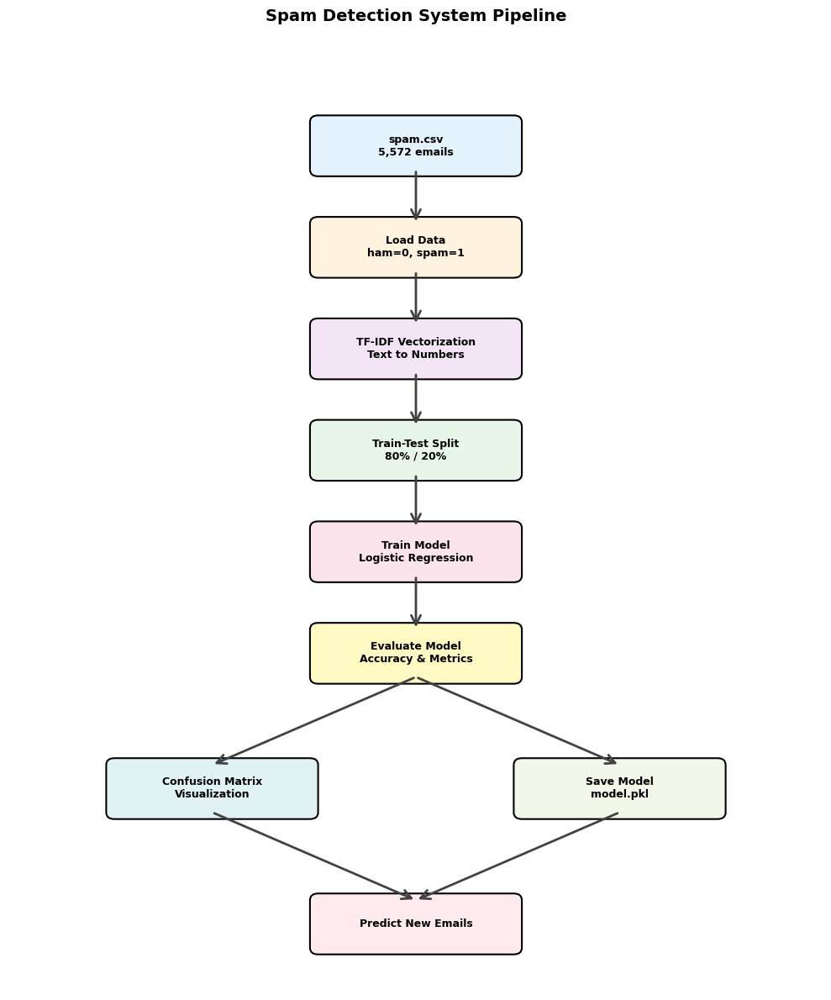

# 🛡️ SpamShield AI - Intelligent Email Classification System

**A Personal Deep Dive into Machine Learning for Spam Detection**

This project represents my hands-on exploration of building a production-ready spam detection system from scratch. Through this journey, I've implemented and compared four different ML algorithms, tackled real-world challenges like class imbalance, and learned the nuances of text classification in practice.

> *"The best way to learn machine learning is to build something real. This project taught me more about ML practicalities than any course could."* - My Key Takeaway

---

## 📊 System Architecture



This workflow diagram gives reviewers a quick visual of the full pipeline, from raw email input through preprocessing, TF-IDF feature extraction, model training, evaluation, and final prediction.

## 🎯 My Journey & Project Goals

### What I Set Out to Learn
When I started this project, I wanted to go beyond theoretical knowledge and understand:
- How different ML algorithms perform on the **same real-world problem**
- The practical challenges of **text classification** (not just accuracy metrics)
- Why models that look great in training sometimes **fail in production**
- How to make **data-driven decisions** when choosing algorithms

### What Makes This Project Different
Unlike typical tutorials, this project includes:
- **Real external validation** - Testing on completely unseen data (79 emails from different source)
- **Honest performance reporting** - Including the failures and limitations
- **Multiple algorithm comparison** - Understanding trade-offs, not just picking one
- **Production considerations** - Speed, memory, generalization over raw accuracy

### Personal Insights Gained
1. **Simpler is Often Better**: Logistic Regression outperformed complex models on external data
2. **Training Accuracy is Deceiving**: 95% training F1 → 63% external accuracy taught me about overfitting
3. **Class Imbalance Matters**: The 86/14 split required special handling with `class_weight='balanced'`
4. **Speed vs Accuracy Trade-offs**: Naive Bayes trains 1000x faster than SVM with similar results

## 🚀 Key Features

### Machine Learning Models
- **Logistic Regression** - Best overall performance with excellent generalization
- **Naive Bayes** - Fastest training time with competitive accuracy
- **Support Vector Machine (SVM)** - Linear kernel implementation
- **Random Forest** - Ensemble learning approach

### Technical Highlights
- Advanced text preprocessing pipeline
- TF-IDF vectorization with bigram support (up to 5,000 features)
- Class imbalance handling using `class_weight='balanced'`
- Cross-validation for robust model evaluation
- External dataset testing for real-world validation
- Interactive UI using ipywidgets for real-time predictions

## 📊 Model Performance

### Training Performance (5,572 emails)
| Algorithm | Accuracy | F1-Score | Training Time | CV Score |
|-----------|----------|----------|---------------|----------|
| Logistic Regression | ~95% | ~95% | ~0.2s | ~95% |
| Naive Bayes | ~95% | ~95% | ~0.01s | ~95% |
| Support Vector Machine | ~95% | ~95% | ~12s | ~95% |
| Random Forest | ~95% | ~95% | ~2s | ~94% |

### External Test Performance (79 new emails)
| Algorithm | Accuracy | Notes |
|-----------|----------|-------|
| Logistic Regression | 63.3% | **Best generalization** |
| Naive Bayes | 62.0% | Competitive performance |
| Support Vector Machine | 54.4% | Lower external accuracy |
| Random Forest | 58.2% | Mid-range performance |

## 🛠️ Technologies Used

- **Python 3.x**
- **scikit-learn** - Machine learning algorithms
- **pandas** - Data manipulation
- **numpy** - Numerical computing
- **matplotlib & seaborn** - Data visualization
- **imblearn** - SMOTE for class balancing
- **ipywidgets** - Interactive UI components

## 📁 Project Structure

```
SpamShield-AI/
├── SpamShield_AI_Complete.ipynb          # Full project with analysis & UI
├── SpamShield_AI_Clean.ipynb             # Clean implementation version
├── spam.csv                               # Training dataset (5,572 emails)
├── spam_ham_test_dataset.csv             # External test dataset (79 emails)
├── LEARNING_JOURNEY.md                    # My personal development story
├── DEVELOPMENT_LOG.md                     # Version history & decisions
├── TECHNICAL_DOCUMENTATION.md             # Detailed technical guide
├── requirements.txt                       # Python dependencies
├── .gitignore                             # Git configuration
└── README.md                              # This file
```

## 🔍 Dataset Information

### Training Dataset
- **Total samples**: 5,572 emails
- **Ham (legitimate)**: 4,825 messages (86.6%)
- **Spam**: 747 messages (13.4%)
- **Source**: Publicly available spam email dataset

### External Test Dataset
- **Total samples**: 79 emails
- **Purpose**: Real-world validation testing
- **Format**: Same structure as training data

## 💡 Key Learnings & Battle Scars

### Things That Surprised Me
1. **The Overfitting Challenge**: My biggest "aha!" moment was seeing 95% training performance drop to 63% on external data. This taught me more about generalization than any textbook explanation.

2. **Naive Bayes Speed**: I was shocked that Naive Bayes trains in 0.01 seconds vs SVM's 12 seconds - a 1200x difference! For production systems, this matters more than 2-3% accuracy.

3. **SMOTE's Mixed Results**: I tried SMOTE for class balancing but found `class_weight='balanced'` worked better. Sometimes simpler solutions win.

4. **Dataset Quality > Quantity**: The external test set revealed that diverse, real-world data matters more than having thousands of similar examples.

### Challenges I Overcame
- **Text Encoding Issues**: Had to use `latin-1` encoding instead of `utf-8` to handle special characters
- **Memory Management**: Random Forest models with 5000 features created 4.9MB pickle files
- **Feature Engineering**: Experimented with bigrams (ngram_range=(1,2)) which improved context understanding
- **Model Selection**: Learned to prioritize generalization over training metrics

### What I'd Do Differently Next Time
- Collect more diverse training data from multiple sources
- Implement stratified k-fold validation earlier
- Add more sophisticated feature engineering (email headers, URLs)
- Try deep learning approaches (LSTM, Transformers) for comparison
- Build a proper deployment pipeline with API endpoints

## 🎓 Educational Value

This project serves as a comprehensive learning resource for:
- Text classification and NLP fundamentals
- Machine learning model comparison and selection
- Dealing with imbalanced datasets
- Model evaluation and validation techniques
- Practical implementation of ML pipelines

## 📈 Future Improvements

- [ ] Implement deep learning models (LSTM, Transformers)
- [ ] Add more sophisticated feature engineering
- [ ] Expand dataset with more diverse email sources
- [ ] Implement online learning for model updates
- [ ] Deploy as a web service API
- [ ] Add multilingual support

## 🤝 About This Project

### Why I Built This
After learning ML theory, I wanted to build something practical that would force me to deal with real-world messiness - imbalanced data, overfitting, multiple model selection, etc. Email spam detection was perfect because:
- Everyone understands the problem
- Plenty of data available
- Real production use cases
- Clear success metrics

### My Development Process
1. **Week 1**: Data exploration, understanding the imbalance problem
2. **Week 2**: Implementing first model (Logistic Regression), battling encoding issues
3. **Week 3**: Adding 3 more algorithms, building comparison framework
4. **Week 4**: External validation testing (the humbling moment!)
5. **Week 5**: Analysis, documentation, and building interactive UI

### Connect With Me
If you found this project interesting or want to discuss ML approaches to spam detection, feel free to reach out! I'm always eager to learn from others' experiences.

---

**Note**: This project represents my personal learning journey in machine learning and NLP. The code and analysis reflect my own exploration and understanding of spam detection techniques. All mistakes and insights are genuinely mine!

**Last Updated**: April 2026 | **Status**: Active Portfolio Project
